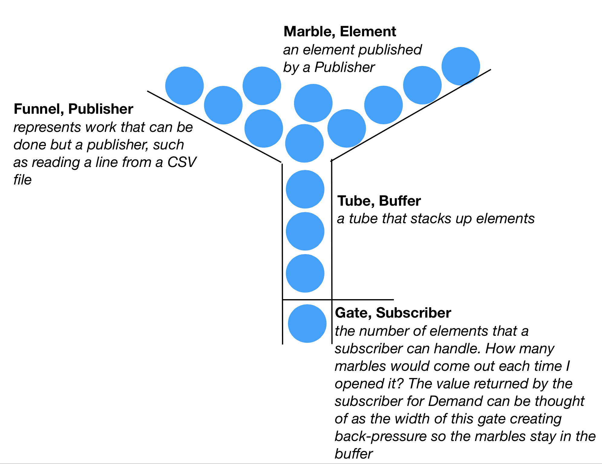

# Combine Backpressure Research CSV

I wrapped a csv file reader (using CSV.swift) to slowly enumerate all the values in a CSV file using backpressure.  Please start with the unit test as the UI is rather trivial and doesn't "do" much more than display a List.

Some breakpoints have been shared to help demonstrate when certain functions are called using backpressure. And some comments suggest where the reader may want to change something to see different use cases of backpressure.

A blogpost to accompany this project can be found [on my website](http://www.paulwoodiii.com/development-blog/2019/8/1/apples-combine-and-reactive-programming-with-back-pressure)

### Try things out

- Try some of the different files for more data.
- What would happen if the Buffer's size was larger in NameImporter.swift line 37? How would that affect the calls to readRow in CSVReader line 223?
- Change the slow in SlowSink
- Make your own Subscriber based off SlowSink
- Consider accumulating the names received and applying an algorithm that works on all previous names. 
- If given a data set where the count was not in decending order Female names then decending order of Male names, group the names and keep a list of names in order based on count
- Use the Names received to create a Try
- Add the names to a CoreData Model 
- Things moving too fast in the `NameListTests.testBackpressure()` ? just increase the `slowBy:` time measures in seconds

### Keep going

Checkout these Combine projects that have helped me learn the framework

- [Open Combine](https://github.com/broadwaylamb/OpenCombine)
- [Entwine](https://github.com/tcldr/Entwine)
- [Using Combine](https://heckj.github.io/swiftui-notes/)

### Known Issues

The CSVReader seems to skip the first element in the CSV file when enumerated so I wrote an empty line of data to get what I expected. I'd appreciate some help and feedback on that

### License

The MIT License (MIT)
Copyright (c) 2019 Paul Wood
